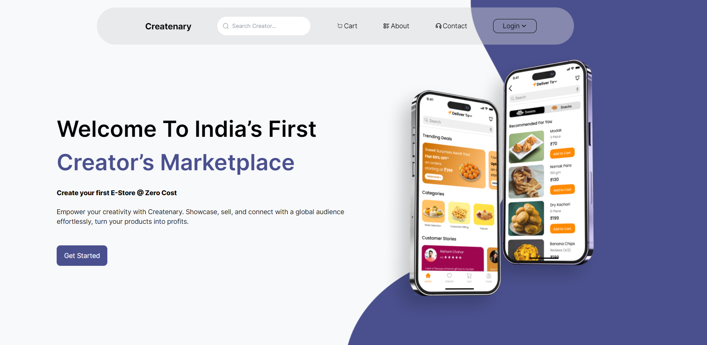

# Createnary Assessment Project

An Assessment project from Createnary , a company that specializes in creating innovative digital products.

## Technologies Used

- **Frontend:**

  - NextJS: JavaScript library for building user interfaces.
  - Range Slider: A component that allows users to select a value from a range by sliding a handle along a track.
  - React Swiper: A carousel/slider library for React applications, providing features like swipe navigation and various transition effects.
  - MAterial UI: A popular React component library that implements Google's Material Design for creating user interfaces.

- **Backend:**
  - Node.js: JavaScript runtime environment.
  - Express: Web application framework for Node.js.
  - Mongoose: For Database Intigeration.

## Screenshots

### Landing Page

### Second Page

## Usage

1. Clone the repository.
2. Install dependencies using `npm install`.
3. Start the backend server using `npm start` in the server directory.
4. Start the frontend development server using `npm start` in the client directory.
5. Access the application in your browser at `http://localhost:3000`.

## Credits

This project is created by Suraj Singhal. Feel free to contribute by submitting bug reports, feature requests, or pull requests.

Happy Collaborating! 🎨✨
